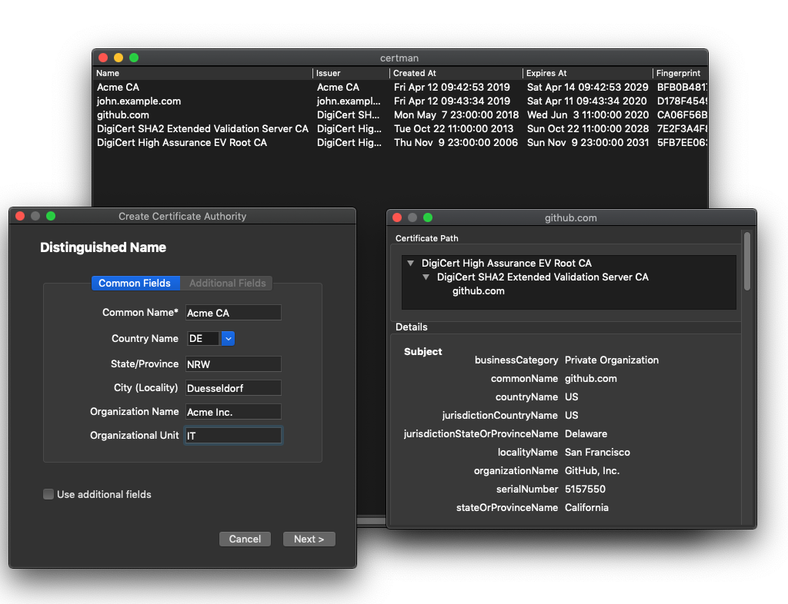

# Certman
Certman is a certificate management tool with a simple GUI where you can create and manage your own PKI.

**NOTE:** This was study project for working with X509 and the Qt Framework. \
Do not use it in production environments! It is not stable, it may contains bugs and has not been security reviewed.

See the [`screenshots` folder](./screenshots/) for more screenshots.

## Development
### Requirements
* CMake 3.10 or higher
* OpenSSL 1.1.1b

### Setup
Before setting-up the project with CMake you need to set the following environment variables:
* `OPENSSL_ROOT_DIR` path to your OpenSSL installation
    
    You can install OpenSSL with homebrew on mac: `brew install openssl@1.1`.
    The environment variable will the look like: `OPENSSL_ROOT_DIR=/usr/local/opt/openssl@1.1`
* `Qt5Widgets_DIR` path to the Qt5Widgets dir containing the `Qt5WidgetsConfig.cmake` config file

    Again, with homebrew (`brew install qt`) the variable look something like this: `Qt5Widgets_DIR=/usr/local/opt/qt/lib/cmake/Qt5Widgets`

## Authors
* [Max van Aerssen](https://github.com/maxvaer)
* [Timo R.](https://github.com/tiri)
* [Joshua Westerheide](https://github.com/jdoubleu)

## Acknowledgements
We used the following tech-stack:
* [Qt5 Framework](https://doc.qt.io/qt-5/qt5-intro.html) for cross-platform desktop application
* [OpenSSL](https://www.openssl.org/) SSL/TLS C library
* The [CMake](https://cmake.org/) build system
* [Googletest](https://github.com/google/googletest) Unit Testing Framework
* [Doxygen](http://www.doxygen.nl/) for API Reference Documentation

## License
This project is licensed under [GPLv3](./LICENSE).
